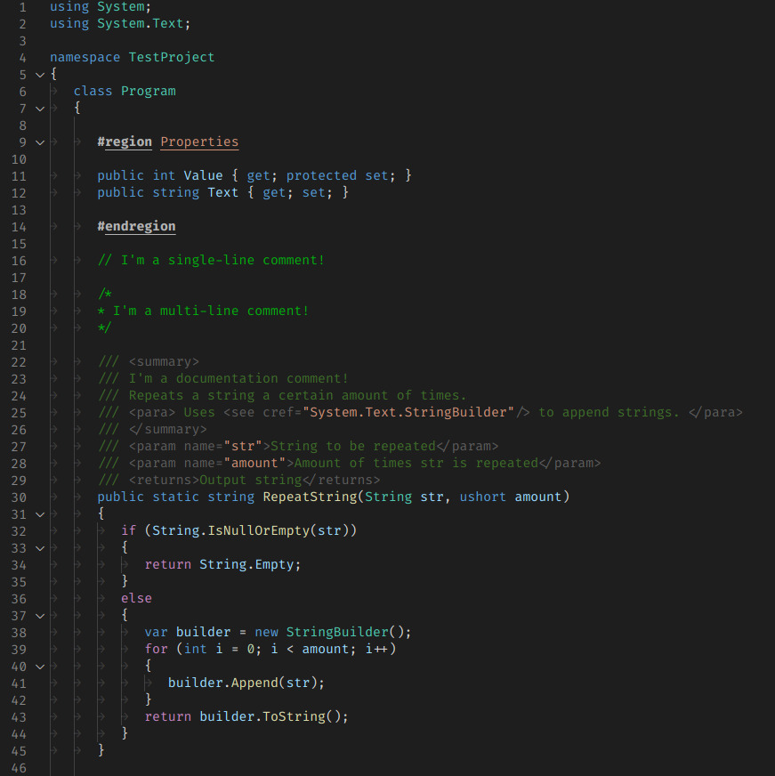
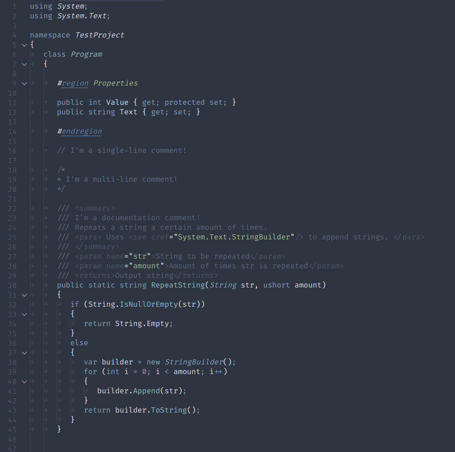

# Some Custom Themes

This package is a small collection of vscode colour themes that I personally use.

~~Right now there's only one but I'm gonna add more at some point, I think. Don't quote me on it.~~
NEVERMIND I DID IT.

## Licensing

Generally everything is licensed using the MIT License (see [License file](LICENSE)).

For themes that are based on other people's work: Please look at the specific readme for the theme (located in `themes/[theme-name]_readme.md`).

## Themes

All Theme names have a `[JG]` prefix.

| Name (links to readme) | Description |
| ---------------------- | ----------- |
| [Dark+](themes/jg-darkplus_readme.md) | Modified version of the [default Dark+](https://github.com/Microsoft/vscode/blob/master/extensions/theme-defaults/themes/dark_plus.json) theme. Changes some C# syntax for better readability. |
| [Nord](themes/jg-nord_readme.md) | The popular [Nord Theme](https://github.com/arcticicestudio/nord-visual-studio-code) with some slight changes. |

## Samples

### [Dark+ based theme](themes/jg-darkplus_readme.md)

### [Nord based theme](themes/jg-nord_readme.md)

