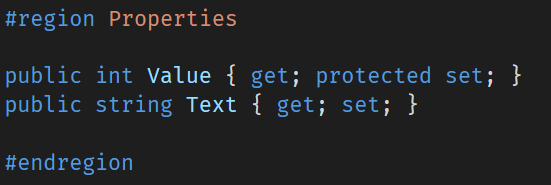
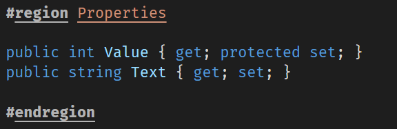
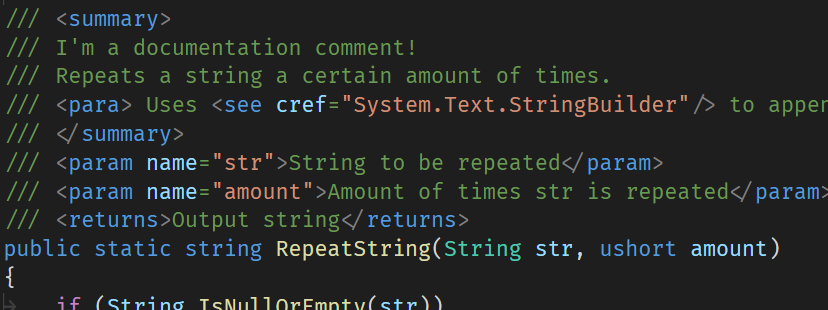
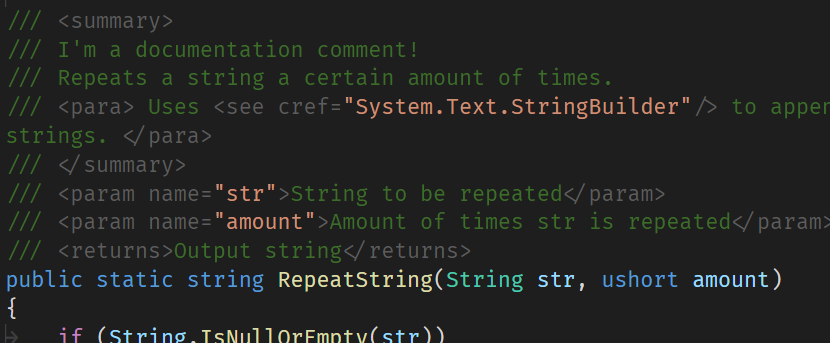

# Dark+Sharp

A dark theme for Visual Studio Code. Based on the default [Dark+](https://github.com/Microsoft/vscode/blob/master/extensions/theme-defaults/themes/dark_plus.json) theme.

Makes only a few changes, mainly to make `C#` code more readable.

## Default vs Dark+Sharp

| Change                                |             Default Dark+ Theme               |          Dark+Sharp                                  |
|:------------------------------------- | --------------------------------------------- | ---------------------------------------------------- |
| More noticable regions                |    |      |
| Less noticable documentation comments |  |    |

## Reasons

I like using `#region` to manage bigger C# files. But I was used to Visual Studio, which highlights regions in a special way, to make them stand out a lot. I felt like the default Dark+ Theme doesn't highlight them in a special manner. I would prefer if I could put a frame around them, like in Visual Studio, but I don't think that's possible (or rather, I am too lazy to find out).

The default dark+ made C# code very 'cluttered', at least to me. The multi-line documentation comments seemed way too colourful and felt a bit, out of place. I think the actual class/method/... is more important, and should be more highlighted than the comment. I also thought about making Classes, Structs, Namespaces and Methods **bold**, but I decided to leave it like this for now.

## Changes

If you want to know what exact changes I made, check out the [corresponding settings.json](templates/jg-darkplus/settings.json) file.

In there are the config changes I made, which override the default theme. After that, you can use the `Generate Color Theme From Current Settings` command in vscode (`Ctrl + Shift + P`) to compile a `color-theme.json` file.
