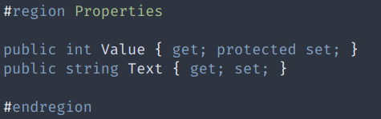
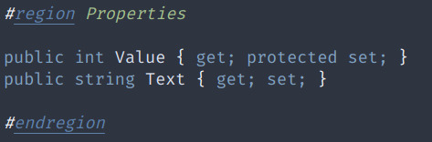
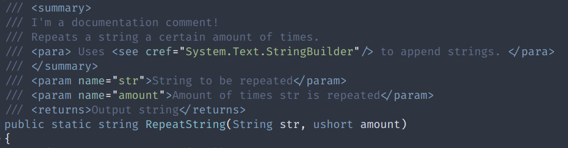
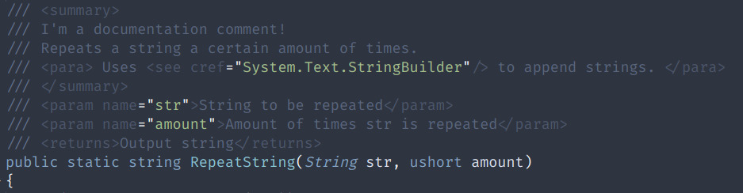
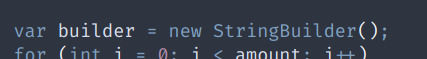
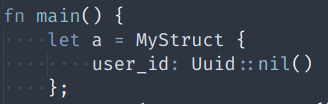
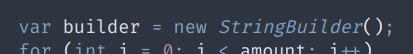

# [JG] Nord

The [Nord Colour Theme](https://github.com/arcticicestudio/nord-visual-studio-code) with some minor changes.

## Default vs [JG] Nord

| Change                                |             Default Dark+ Theme                          |          [JG] Dark+                                  |
|:------------------------------------- | -------------------------------------------------------- | ---------------------------------------------------- |
| More noticable regions                |    |                |
| Less noticable documentation comments* |  |              |
| More noticable types** |   |   |

*should apply generally, some aspects might be C# specific

**applies generally, examples show C# and Rust.

## Changes

An exact list of changes can be seen in the [templates/jg-nord/settings.json](templates/jg-nord/settings.json) file.
The settings there directly overwrite the one's from the [official Nord Theme](https://github.com/arcticicestudio/nord-visual-studio-code).
